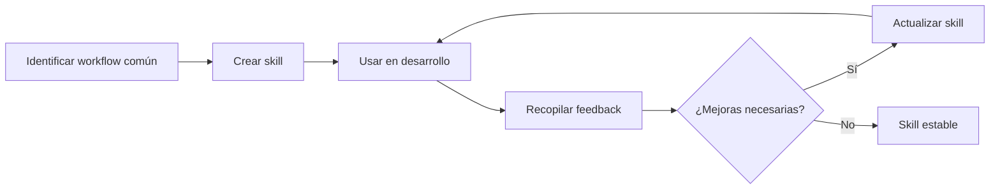

# Skills - Plataforma Lanek

> Workflows reutilizables y paso a paso para simplificar tareas comunes de desarrollo, testing, documentación e infraestructura.

## 📋 ¿Qué son los Skills?

Los **skills** son workflows documentados que combinan múltiples agentes para completar tareas complejas de forma sistemática. Cada skill es una guía paso a paso que coordina acciones, valida criterios de calidad y asegura resultados consistentes.

## 🎯 Skills Disponibles

### 1. [new-module](./new-module.skill.md) - Crear Módulo Backend Completo

**Descripción**: Workflow automatizado para crear un módulo CRUD completo con todas las capas: modelo Prisma, service, controller, DTOs, tests, documentación y validación de calidad ISO 25010.

**Cuándo usar**:

- Necesitas crear un nuevo módulo con operaciones CRUD
- Quieres asegurar que todo el stack esté completo (DB → API → Tests → Docs)
- Requieres cumplir con estándares de calidad desde el inicio

**Agentes involucrados**: backend, qa_tester, documentator

**Ejemplo de uso**:

```
Usa el skill new-module para crear módulo "reports" con:
- Campos: title (string), type (enum: daily|weekly|monthly), userId (relación), data (json)
- Relaciones: belongsTo User
- Roles: ADMIN puede ver todos, USER solo los suyos, DELETE solo ADMIN
```

**Resultado**:

- ✅ Modelo Prisma creado y migrado
- ✅ Módulo NestJS con CRUD completo
- ✅ Tests completos (cobertura ≥80%)
- ✅ Documentación Swagger y README.md actualizado
- ✅ QA_TESTING.md actualizado

---

### 2. [add-endpoint](./add-endpoint.skill.md) - Agregar Endpoint a Módulo Existente

**Descripción**: Workflow para agregar un endpoint personalizado a un módulo ya existente, asegurando tests, documentación y compatibilidad con la arquitectura actual.

**Cuándo usar**:

- Necesitas agregar funcionalidad específica a un módulo existente
- Quieres un endpoint custom más allá del CRUD básico
- Requieres endpoint con lógica de negocio particular

**Agentes involucrados**: backend, qa_tester, documentator

**Ejemplo de uso**:

```
Usa el skill add-endpoint para agregar en módulo "users":
- Método: POST
- Path: /users/:id/change-password
- Funcionalidad: Cambiar contraseña del usuario
- Roles: USER puede cambiar propia, ADMIN puede cambiar cualquiera
- Body: { currentPassword: string, newPassword: string }
```

**Resultado**:

- ✅ Endpoint funcional en controller
- ✅ Lógica implementada en service
- ✅ Tests completos (cobertura ≥80%)
- ✅ Swagger actualizado
- ✅ README.md actualizado

---

### 3. [integrate-microservice](./integrate-microservice.skill.md) - Integrar Microservicio Python

**Descripción**: Workflow completo para integrar un microservicio Python con el backend, procesando su documentación y generando especificaciones de integración para coordinación bidireccional.

**Cuándo usar**:

- Necesitas integrar un nuevo microservicio Python
- El microservicio requiere comunicación con el backend NestJS
- Necesitas coordinar RabbitMQ, volúmenes compartidos o WebSocket
- Tienes documentación del microservicio para procesar

**Agentes involucrados**: integrator, devops, backend, qa_tester, documentator

**Ejemplo de uso**:

```
Usa el skill integrate-microservice para integrar "data-analyzer":

Coloca documentación en:
.github/integration/input/data-analyzer.md

Microservicio:
- Nombre: data-analyzer
- Tipo: Análisis de datos con Python/Pandas
- Comunicación: RabbitMQ (cola: tasks.analysis)
- Input: JSON con userId y filePath
- Output: JSON con results y metrics
- Trigger: POST /api/analysis/start
```

**Resultado**:

- ✅ Especificación generada en `.github/integration/output/`
- ✅ Docker Compose configurado (dev/qa/prod)
- ✅ Comunicación implementada en backend
- ✅ Tests de integración completos
- ✅ README.md y QA_TESTING.md actualizados

---

### 4. [run-qa-audit](./run-qa-audit.skill.md) - Auditoría Completa de QA

**Descripción**: Workflow para ejecutar una auditoría exhaustiva de calidad en todo el proyecto, generando reporte completo con métricas, issues encontrados y recomendaciones.

**Cuándo usar**:

- Antes de un release importante
- Para validar cumplimiento ISO 25010
- Cuando necesitas un reporte completo de calidad
- Para identificar gaps en testing o documentación
- Preparación para certificación

**Agentes involucrados**: qa_tester, backend, documentator, devops, integrator

**Ejemplo de uso**:

```
Usa el skill run-qa-audit para auditoría completa:

Alcance: Proyecto completo
Nivel: Exhaustivo
Incluir: Tests, código, docs, infraestructura, integraciones

Genera reporte detallado con todas las métricas y recomendaciones.
```

**Resultado**:

- ✅ Reporte completo de auditoría con métricas
- ✅ Lista de issues priorizados
- ✅ Estado de cumplimiento ISO 25010
- ✅ Recomendaciones accionables
- ✅ Visibilidad completa del estado de calidad

---

### 5. [update-docs](./update-docs.skill.md) - Actualizar Documentación

**Descripción**: Workflow para mantener la documentación sincronizada con el código, asegurando que README.md, QA_TESTING.md y otros documentos reflejen el estado actual del proyecto.

**Cuándo usar**:

- Después de implementar nuevas features
- Cuando cambias arquitectura o infraestructura
- Antes de un release
- Cuando detectas documentación obsoleta
- Para sincronizar métricas de QA

**Agentes involucrados**: documentator, qa_tester

**Ejemplo de uso**:

```
Usa el skill update-docs después de crear módulo "reports":

Tipo: Nueva feature
Módulo: reports
Endpoints: GET/POST/PATCH/DELETE /api/reports
Modelo: Reports (id, title, type, userId, data, createdAt)
Tests: 18 tests, 87% coverage
Performance: p95 142ms

Actualiza README.md, QA_TESTING.md y CHANGELOG.md
```

**Resultado**:

- ✅ README.md actualizado
- ✅ QA_TESTING.md sincronizado
- ✅ CHANGELOG.md actualizado
- ✅ Swagger completo y accesible
- ✅ Documentación coherente sin contradicciones

---

### 6. [setup-environment](./setup-environment.skill.md) - Configurar y Validar Entorno

**Descripción**: Workflow para configurar correctamente los entornos (dev/qa/prod), validar aislamiento, sincronizar variables de entorno y prevenir conflictos en infraestructura compartida.

**Cuándo usar**:

- Setup inicial del proyecto
- Configurar nuevo entorno (qa o prod)
- Validar aislamiento entre entornos
- Sincronizar variables de entorno
- Antes de deployment
- Después de agregar microservicios

**Agentes involucrados**: devops, documentator

**Ejemplo de uso**:

```
Usa el skill setup-environment para configuración inicial:

Acción: Setup completo
Entornos: dev, qa, prod
Componentes: backend, PostgreSQL

Configura variables de entorno, docker-compose, secrets de GitHub y valida aislamiento.
```

**Resultado**:

- ✅ Variables de entorno configuradas
- ✅ .env.example actualizado
- ✅ GitHub Secrets configurados
- ✅ Docker Compose sin conflictos
- ✅ Aislamiento validado
- ✅ Workflows CI/CD funcionales

---

## 🚀 Cómo Usar un Skill

### Opción 1: Referencia directa

```
Usa el skill [nombre-skill] para [descripción de tarea]:

[Inputs específicos]
```

Ejemplo:

```
Usa el skill new-module para crear módulo "tasks" con:
- Campos: title, description, status, userId
- CRUD completo
```

### Opción 2: Seguir manualmente

1. Abre el archivo del skill (ej: `new-module.skill.md`)
2. Lee la sección "Workflow paso a paso"
3. Sigue cada paso invocando los agentes correspondientes
4. Valida criterios de calidad en cada paso
5. Verifica el resultado esperado al final

### Opción 3: Skill como contexto

```
@copilot Siguiendo el workflow del skill new-module, ayúdame a crear módulo "reports"
```

---

## 📊 Matriz de Skills y Agentes

| Skill                  | Backend | QA Tester | Documentator | Integrator | DevOps |
| ---------------------- | ------- | --------- | ------------ | ---------- | ------ |
| new-module             | ✅      | ✅        | ✅           | -          | -      |
| add-endpoint           | ✅      | ✅        | ✅           | -          | -      |
| integrate-microservice | ✅      | ✅        | ✅           | ✅         | ✅     |
| run-qa-audit           | ✅      | ✅        | ✅           | ✅         | ✅     |
| update-docs            | -       | ✅        | ✅           | -          | -      |
| setup-environment      | -       | -         | ✅           | -          | ✅     |

---

## 🎯 Flujos de Trabajo Típicos

### Desarrollo de nueva feature

1. **`new-module`** → Crear módulo completo
2. **`add-endpoint`** → Agregar endpoints específicos (si necesario)
3. **`update-docs`** → Actualizar documentación
4. **`run-qa-audit`** → Validar calidad antes de PR

### Integración de microservicio

1. **`integrate-microservice`** → Configurar integración
2. **`setup-environment`** → Actualizar entornos
3. **`update-docs`** → Documentar integración
4. **`run-qa-audit`** → Validar integración completa

### Preparación para release

1. **`run-qa-audit`** → Auditar calidad completa
2. **`update-docs`** → Sincronizar toda la documentación
3. **`setup-environment`** → Validar entornos (qa y prod)

### Setup inicial de proyecto

1. **`setup-environment`** → Configurar todos los entornos
2. **`new-module`** → Crear módulos iniciales (auth, users)
3. **`update-docs`** → Documentar arquitectura y setup
4. **`run-qa-audit`** → Establecer línea base de calidad

---

## 💡 Tips y Mejores Prácticas

### 1. Usar skills como checklist

Incluso si no invocas el skill completo, úsalo como checklist para asegurar que no olvidas pasos importantes.

### 2. Personalizar según necesidad

Los skills son plantillas. Ajusta los pasos según las necesidades específicas de tu tarea.

### 3. Documentar desviaciones

Si te desvías del workflow del skill, documenta por qué en el commit o PR.

### 4. Combinar skills

Muchas tareas requieren combinar múltiples skills. Usa la matriz de arriba para identificar el flujo óptimo.

### 5. Validar criterios de calidad

Cada paso tiene criterios de calidad. No avances al siguiente paso sin validarlos.

### 6. Mantener skills actualizados

Si encuentras mejores prácticas o pasos faltantes, actualiza el skill correspondiente.

---

## 🔄 Ciclo de Vida de un Skill



---

## 📚 Recursos Relacionados

### Agentes

- [backend.agent.md](../agents/backend.agent.md) - Desarrollo backend NestJS
- [qa_tester.agent.md](../agents/qa_tester.agent.md) - Testing y QA
- [documentator.agent.md](../agents/documentator.agent.md) - Documentación
- [integrator.agent.md](../agents/integrator.agent.md) - Integración microservicios
- [devops.agent.md](../agents/devops.agent.md) - CI/CD e infraestructura

### Documentación del proyecto

- [README.md](../../README.md) - Documentación principal
- [QA_TESTING.md](../../QA_TESTING.md) - Estrategias de testing
- [CHANGELOG.md](../../CHANGELOG.md) - Historial de cambios
- [CONTRIBUTING.md](../../CONTRIBUTING.md) - Guía de contribución

---

## 🆘 Soporte

Si tienes dudas sobre cómo usar un skill:

1. Lee el archivo completo del skill
2. Revisa los ejemplos de uso
3. Consulta la sección de Troubleshooting
4. Pregunta al agente correspondiente

Si encuentras un problema o mejora en un skill:

1. Documenta el issue
2. Propone una solución
3. Actualiza el skill
4. Comparte el aprendizaje con el equipo

---

**Última actualización**: 20 de abril de 2026
**Mantenido por**: Equipo de desarrollo con asistencia de agentes especializados
